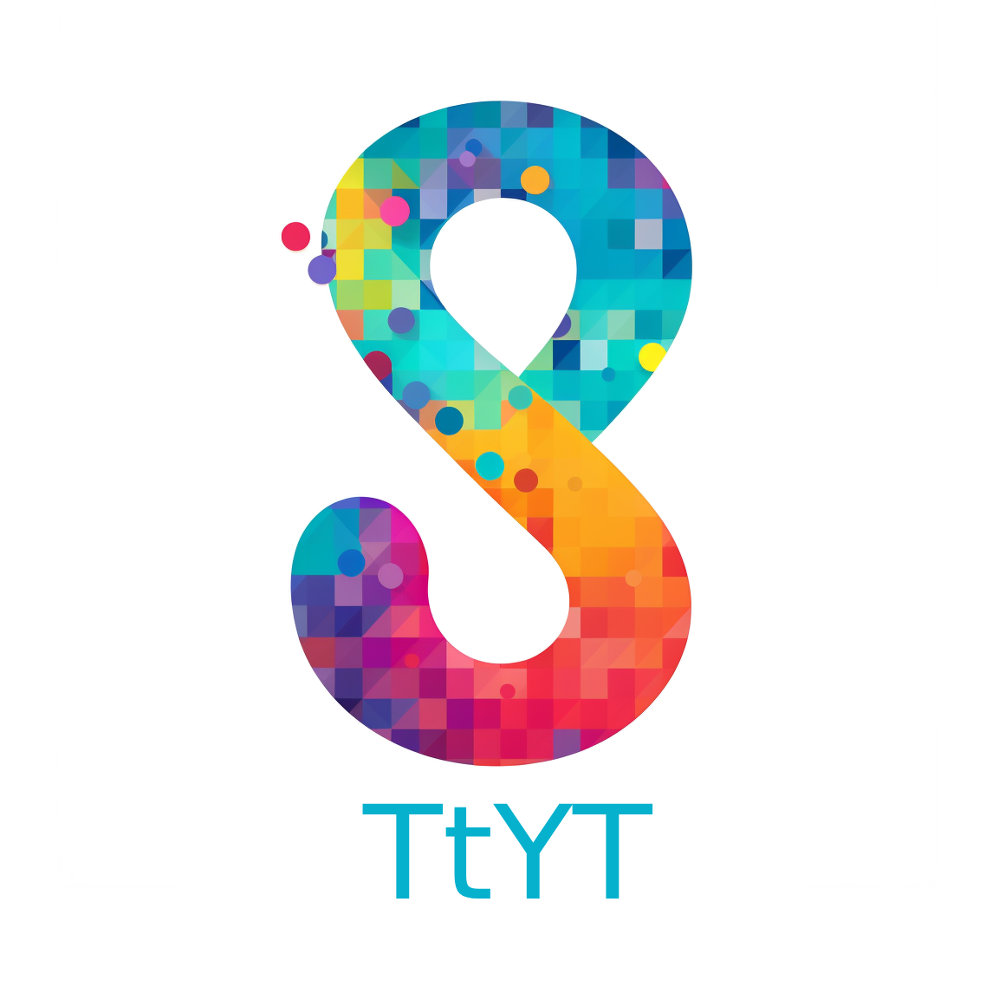

<div align="center">

  <a href="https://github.com/SulemanKazi/TTyT/">
    
  </a>

<h4>Talk to Youtube! </h4>

https://github.com/SulemanKazi/TTyT/assets/12900179/17a51eef-c566-40e3-a0f5-caf5ecd5e5d9

</div>

## Overview

TtYT (Talk to YouTube) is an (almost) instant Retrieval Augmented Generation (RAG)
based Question-Answering system for YouTube videos that you can run locally.
It uses Youtube-DL to get the transcript (or captions) for a video,
and then uses [Vectara](www.vectara.com) to set up the Retrieval and Generation
Systems on top of it.

You then ask it questions and it generates answers with actual references
to (with timestamps) of what the answer is based on from within video's content. The UI is a 
hacky terminal right now, but you can extend it to take audio as input or produce audio as output.

## Usage

### 1. Get the code and requirements

Clone the repo, install the requirements in `requirements.txt`:

```
python -m venv ./ttyt_venv/
source ./ttyt_venv2/bin/activate
pip install -r requirements.txt
```

### 2. Create a Vectara account

Sign up for a [Vectara account](https://console.vectara.com/signup). The free
tier should be enough for even the larger videos you want to talk to. Once
you're logged in, create a corpus (you can name it anything) and note the
Corpus ID (you'll need it for step 3).


Also note your customer ID:


And create an API Key from the "API Access" tab in the menu that we will use to
index the data and query it (make sure you give it both query and indexing access):


### 3. Talk to Youtube!
In the terminal you are using to run the program, define the following variables
that will be used by the program:


```
export CUSTOMER_ID=YOUR_CUSTOMER_ID
export CORPUS_ID=YOUR_CORPUS_ID
export API_KEY=YOUR_API_KEY

```

Then simply start the program with:
```
python talk_to_youtube.py --video-url=https://www.youtube.com/watch?v=ZNVuIU6UUiM
```

Note that the program works well for videos with manual subtitles. For some
reason for videos with auto-generated captions YoutubeDL puts all the downloaded
captions under one timestamp which can cause issues.

IMPORTANT NOTE: If you want to talk to another video, its best to clear the data
in the existing corpus from the web console avoid data overlap between multiple
videos. This will be a flag when running the program in the future (when I
switch to using JWT tokens instead of API Keys) so it will automatically
create a new corpus if desired. Also if you create a new corpus
make sure your API key has access to it!

### Bugs? Feature Requests?

Please report any bugs, and feel free to submit Pull Requests for any features
or improvements you want to see! Maybe you want to have the output be an AI
generated voice instead of text? Maybe you want a snazzy new UI! Build it and
add it to the repo!
